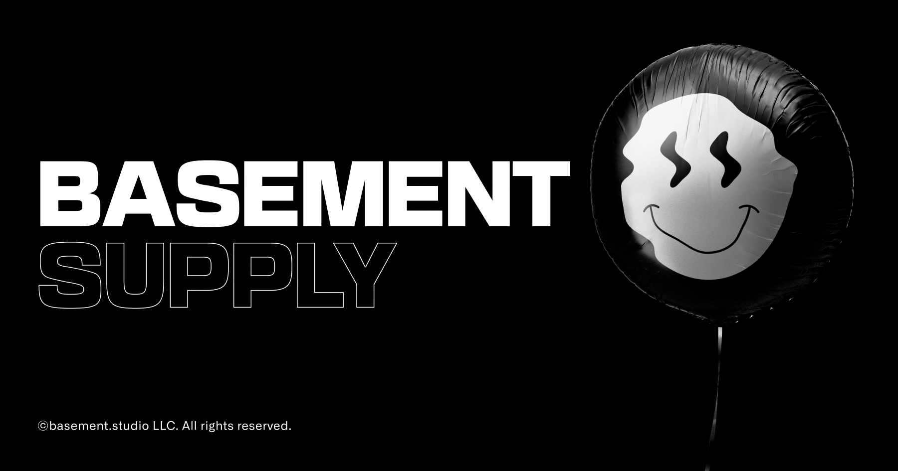
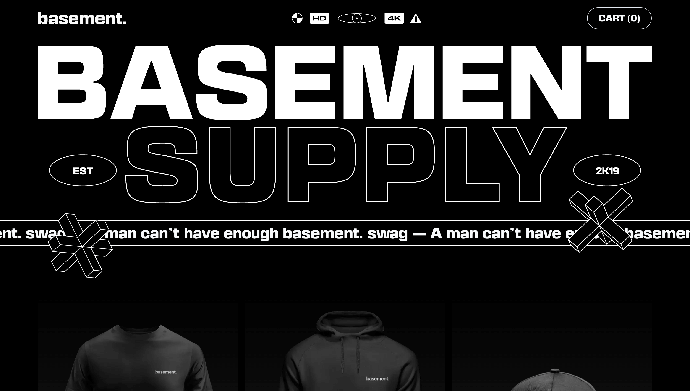
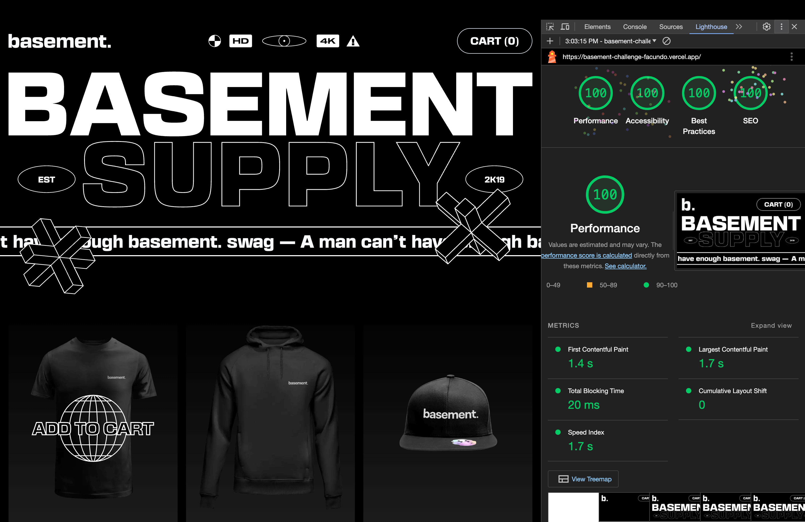

# Basement Challenge

This is my solution to the Basement Frontend Challenge. [Live site](http://basement-challenge.vercel.app)

## Tech Stack

**Code:** Next.js 14, TypeScript, Tailwind CSS, shadcn/ui (Radix UI)

**Deploy:** Vercel

## Optimizations

- [ ] Better handle state managment or incorporate URL-based state persistence.
- [ ] Implement a toast notification to inform users when a product has been successfully added to the cart.
- [ ] Refine minor details to achieve pixel-perfect with Figma design.

## Screenshots

## Lighthouse score

## Final comments

In this challenge, I took on some truly demanding tasks. Building a project from the ground up in just two days is quite a challenge! However, I'm proud of the result I've achieved. I'm aware there's room for improvement, but this is an honest representation of my skills during a challenge in a short period of time. I hope you all enjoy it!

## Author

- [Facundo Perez Montalvo](https://facuperezm.vercel.app)

